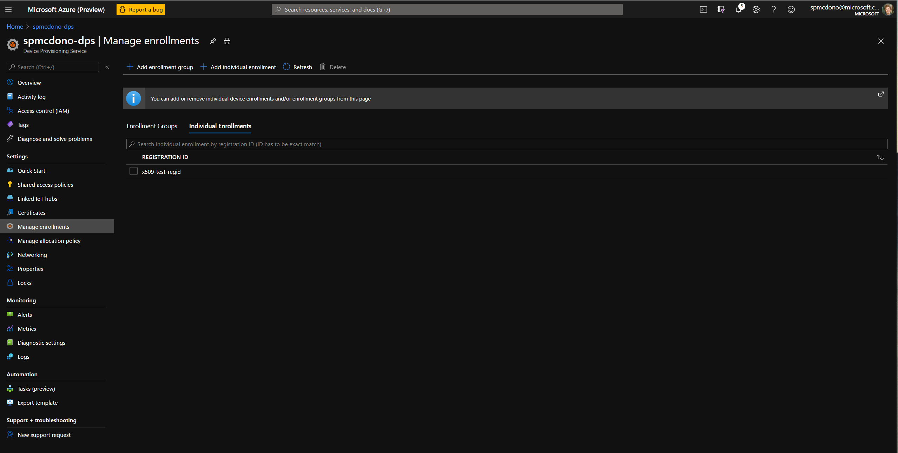
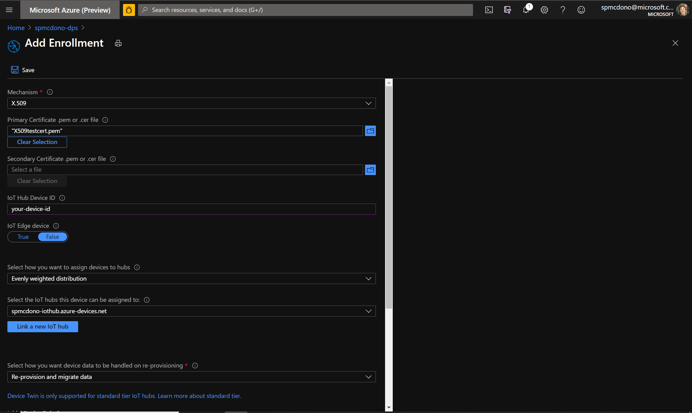

# Quickstart: Provision an MXChip using the Azure RTOS Getting Started Guide and an OpenSSL-generated self-signed certificate

In this quickstart, you will learn how to connect an MXChip to Azure IoT Hub using Azure's Device Provisioning Service (DPS) and a self-signed X.509 certificate. You will use OpenSSL on the command line to generate a private key and device certificate to provide the credentials to connect to DPS and IoT Hub. You will then use sample code from the [Azure RTOS](https://github.com/azure-rtos) in the [Getting Started Guide](https://github.com/azure-rtos/getting-started) to handle the certificate and key, connect to DPS, and start sending telemetry to IoT Hub. You will then use the [Azure IoT Explorer](https://github.com/Azure/azure-iot-explorer/releases) to view the telemetry being sent by the device.

**NOTE:** This quickstart is based on the ["Quick Create Simulated Device x509"](https://github.com/MicrosoftDocs/azure-docs/blob/master/articles/iot-dps/quick-create-simulated-device-x509.md) tutorial.

## Prerequisites

* A PC running Windows 10environment.
* [Git](https://git-scm.com/download/win) 
    
  > **IMPORTANT**: Make sure you select the option to use Git from the command line. This will allow you to run the OpenSSL commands directly from the command line.


## Prepare the development environment

### Clone the repository
```bash
git clone --recursive https://github.com/azure-rtos/getting-started
```

### Install the tools

Run the setup script to install the required tools.

> NOTE: You can install the following with the installation batch script provided in gsg
>  * [GCC](https://developer.arm.com/tools-and-software/open-source-software/developer-tools/gnu-toolchain/gnu-rm)
>  * [CMake](https://cmake.org/)
>  * [Termite](https://www.compuphase.com/software/termite-3.4.exe)
>  * [Azure IoT Explorer](https://docs.microsoft.com/azure/iot-pnp/howto-use-iot-explorer)

Install required tools using the provided batch script:
```bash
getting-started\tools\get-toolchain.bat
```

Run a `Git Bash` shell and confirm installation of Git, OpenSSL and CMake
```bash
git --version
openssl version
cmake --version
```

## Create Azure Resources
Follow [this](https://docs.microsoft.com/azure/iot-dps/quick-setup-auto-provision) guide to set up your DPS and IoT Hub enpoints.

## Create a Self-Signed X.509 Certificate
```bash
openssl genrsa -out private_key.pem 2048
# Common Name = Registration ID ... THIS FIELD IS IMPORTANT ... WRITE DOWN WHATEVER YOU ENTER HERE
openssl req -new -key private_key.pem -out cert_sign_req.csr
openssl x509 -req -days 365 -in cert_sign_req.csr -signkey private_key.pem -out x509_test_cert.pem
openssl x509 -outform DER -inform PEM -in x509_test_cert.pem -out device_cert_formatted.der
openssl rsa -inform PEM -outform DER -in private_key.pem -out private_key_formatted.der
xxd -i device_cert_formatted.der > cert.c
xxd -i private_key_formatted.der >> cert.c 
```

## Create a device enrollment entry in DPS
If you haven't already, please set up your [DPS and IoT Hub instances](https://docs.microsoft.com/azure/iot-dps/quick-setup-auto-provision).
1. Sign in to the Azure portal, select the **All resources** button on the left-hand menu and open your Device Provisioning service.

1. Select the **Manage enrollments** tab

1. Select the **Add individual enrollment** button at the top.

1. In the **Add Enrollment** panel, enter the following information, then press the **Save** button.

    * **Mechanism:** Select **X.509** as the identity attestation *Mechanism*.
    * **Primary certificate .pem or .cer file:** Choose **Select a file** to select the certificate file, X509_test_cert.pem, you created earlier.
    * **IoT Hub Device ID:** Enter **test-x509-device** to give the device an ID.

      <!-- [](./media/quick-create-simulated-device-x509/device-enrollment.png#lightbox) -->

      On successful enrollment, your X.509 device appears as whatever you set your **COMMON NAME** when you created your cert_sign_req.csr.

## Prepare and Flash Your Device
1. The file cert.c you created with xxd will have two `unsigned char` arrays `device_cert_formated_der[]` and `private_key_formatted_der[]`. Copy the values of these arrays to `iot_x509_device_cert[]` and `iot_x509_private_key[]` respectively on the file *MXChip/AZ3166/app/azure_dps_x509_cert_config.h*, replacing the values `{0x00}`.

1. Navigate to the file *MXChip/AZ3166/app/azure_dps_x509_cert_config.h*, setting the following pre-processor variables:
```c
#define WIFI_SSID     "<your-wifi-ssid>"
#define WIFI_PASSWORD "<your-wifi-password>"

#define IOT_HUB_HOSTNAME  "<your-iothub-name>.azure-devices.net"
#define IOT_HUB_DEVICE_ID "test-x509-device"

#define IOT_DPS_ID_SCOPE        "<your-dps-id-scope>"
#define IOT_DPS_REGISTRATION_ID "<your-registration-id>" # the title of your individual enrollment
```

1. Run `MXChip\AZ3166\tools\rebuild.bat`


## Use Azure IoT Explorer to See Your Device in Action
1. Follow [this](https://docs.microsoft.com/azure/iot-pnp/howto-use-iot-explorer) guide to install and set up your Azure IoT Explorer.

2. [Link the explorer to the IoT Hub](https://docs.microsoft.com/azure/iot-pnp/howto-use-iot-explorer#connect-to-your-hub) you created in this tutorial.

3. You can now click on the IoT Hub link in the explorer and see your device listed. 
    * Click into your device dashboard
    * Click **Telemetry** on the left panel
    * Click **Start** at the top of the central panel. 

You should see an output like this:
    
```
12:53:45 PM, 11/10/2020:
{
  "body": {
    "pressure": 1016.76
  },
  "enqueuedTime": "2020-11-10T20:53:45.444Z",
  "properties": {}
}
```

4. You can also invoke a method on the device. Click "Direct Method" on the left panel and set **Method Name** to *setLedState* with **Payload** as true. Press "Invoke Method" at the top of this panel and see the led on your board light up! Set **Payload** to false to turn it back off.

And that's it! We hope you enjoyed this tutorial and that it has helped you on your way to securely provisioning a device using Azure RTOS.

Credits: Tim Stapko, Ryan Walker, Jelani Brandon, Ricardo Minguez Pablos (Rido)